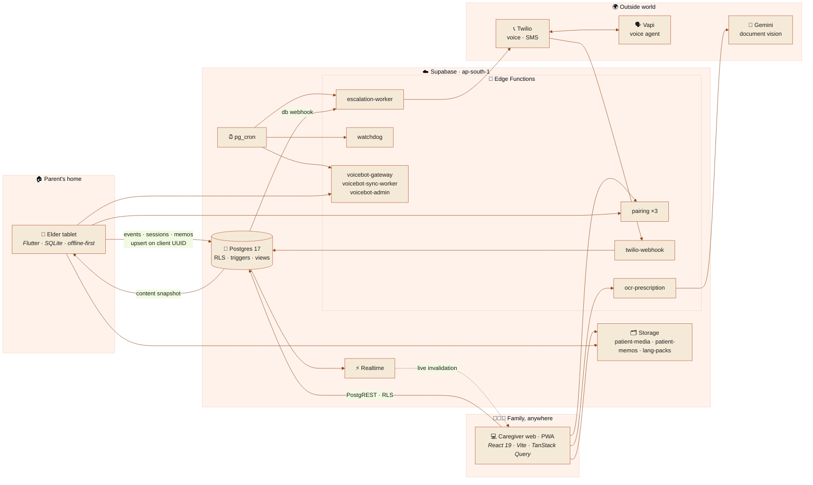
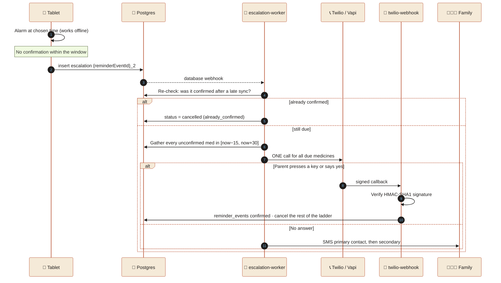
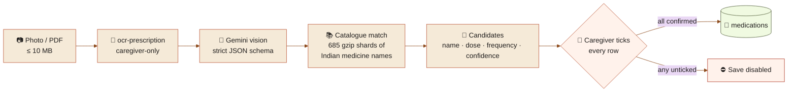
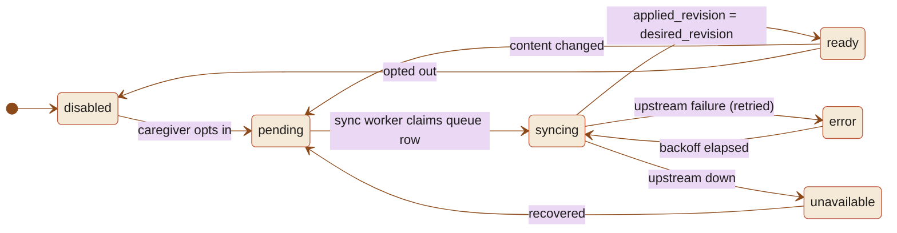
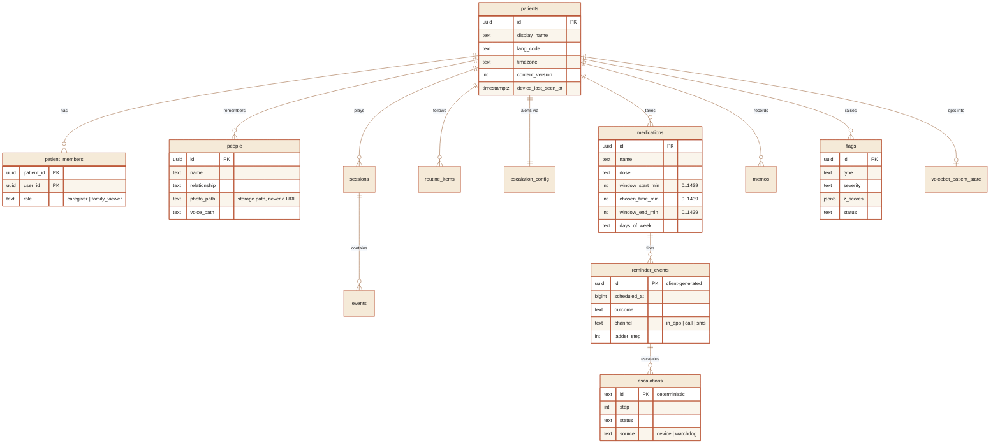
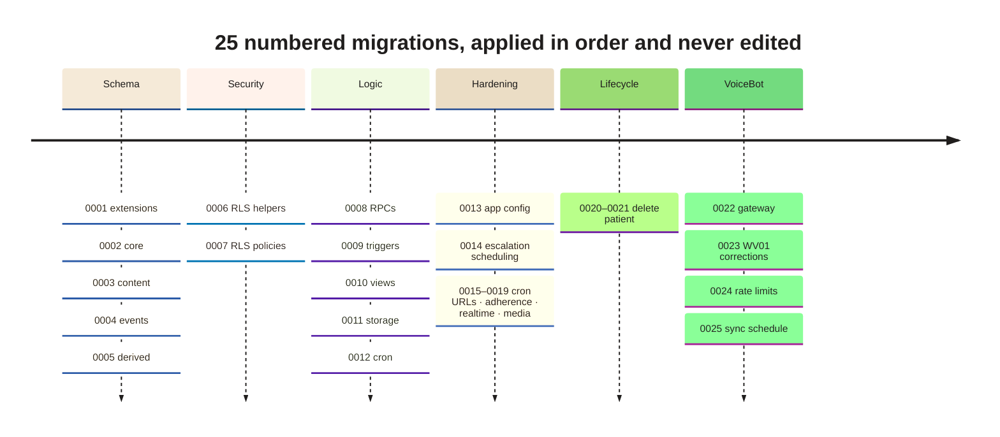
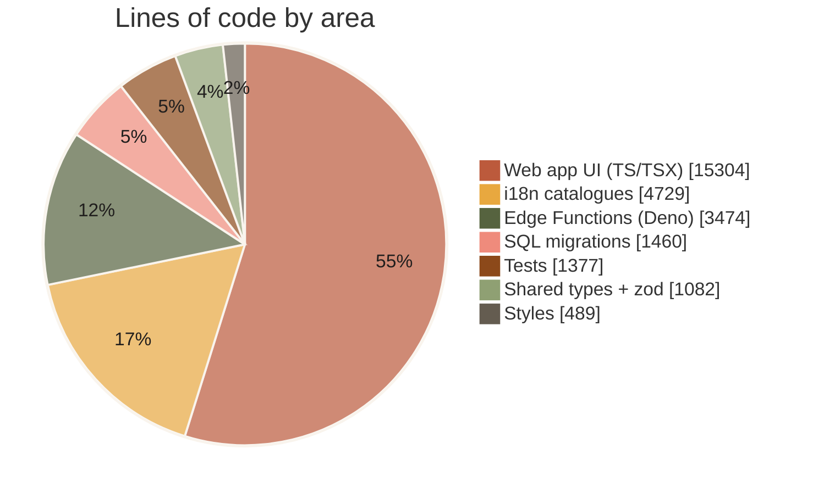

<div align="center">


<br/>

<a href="#-the-idea"></a>
<a href="#-languages"></a>
<a href="#-security-model"></a>

<br/>


<br/><br/>

**[The idea](#-the-idea)** ·
**[Features](#-what-it-does)** ·
**[Architecture](#-architecture)** ·
**[Escalation](#-the-missed-dose-ladder)** ·
**[Data model](#-data-model)** ·
**[Security](#-security-model)** ·
**[Languages](#-languages)** ·
**[Getting started](#-getting-started)** ·
**[Project layout](#-project-layout)**

</div>


## 🪢 The idea

> _Smriti_ (स्मृति) means **memory**.

Many families in Northeast India live far from their ageing parents. Smriti is how they stay close. A tablet in the parent's home runs memory games, shows photos of family, and reminds them about medicine in their own language. On the other side, the family uses a caregiver web app that answers one question every morning: **is Ma okay today?**

The logo is **four strands woven into a knot**. Across the Northeast, handloom is how one generation hands memory to the next: the _mekhela_, the _gamosa_, the _puan_. The whole product is built on that idea: warm terracotta and cream, woven pattern bands, hill layers, and a sky that follows the parent's local time.

<table>
<tr>
<td width="33%" valign="top">

### 👵 For the parent

A Flutter tablet that works offline. Medicine alarms with recorded voice and a pill photo. Memory games. Faces of family with the voice of the person who recorded them.

</td>
<td width="33%" valign="top">

### 👨‍👩‍👧 For the family

A caregiver web app and PWA. A daily picture of routine, medicine and mood. Trends over weeks. Voice notes. Alerts only when something actually needs attention.

</td>
<td width="33%" valign="top">

### 🛟 For the bad day

If a dose is missed, Smriti escalates: a phone call in the parent's language, then SMS to family. A server-side watchdog checks that this still happens when the tablet itself is offline.

</td>
</tr>
</table>


## ✨ What it does

|     | Feature              | What the caregiver gets                                                                                                                                                         |
| :-: | -------------------- | ------------------------------------------------------------------------------------------------------------------------------------------------------------------------------- |
| 🏠  | **Today dashboard**  | Whether she played, took her medicine and was engaged today, computed in _her_ timezone rather than the viewer's                                                                |
| 📈  | **Trends**           | Cognitive-domain trajectories as small multiples, plus change-point flags (`decline`, `engagement_drop`, `adherence_drop`, `device_offline`)                                    |
| 📑  | **Deep report**      | A report page with seven sections, built on `daily_*` report views and never on raw events                                                                                      |
| 📅  | **Engagement**       | Calendar heatmap and adherence over time                                                                                                                                        |
| 💊  | **Medicines**        | Dose windows set on a slider, a pill photo and a recorded voice prompt for each medicine                                                                                        |
| 📸  | **Prescription OCR** | Photograph a prescription and it proposes medicines to add. Names are matched against a catalogue of Indian medicines, and you tick every row yourself before anything is saved |
| 🧑‍🤝‍🧑  | **People**           | Family photos, voices and memory prompts that the tablet shows in its recognition games                                                                                         |
| 🗓️  | **Routine**          | The daily routine, shown on the tablet                                                                                                                                          |
| 🎙️  | **Messages**         | Voice memos from the parent, with transcripts and read state                                                                                                                    |
| 🔔  | **Alerts**           | Primary and secondary contacts for the escalation ladder                                                                                                                        |
| 🔐  | **Access**           | Invite siblings as `caregiver` or as read-only `family_viewer`                                                                                                                  |
| 📟  | **Tablet**           | Pairing by QR code or short code, with live heartbeat and sync status                                                                                                           |
| 🗣️  | **VoiceBot**         | An opt-in conversational voice agent for each patient, synced through a queued worker                                                                                           |
| 🌐  | **Localised UI**     | Caregiver interface in English, Hindi, Assamese, Meiteilon (Meetei Mayek) and Khasi                                                                                             |
| 🌗  | **Their sky**        | The app's backdrop follows day and night at the parent's location                                                                                                               |

<details>
<summary><b>🧭 Every route in the web app</b> (click to expand)</summary>

<br/>

| Route                      | Page                                                                                                                                  |
| -------------------------- | ------------------------------------------------------------------------------------------------------------------------------------- |
| `/`                        | Marketing site when signed out; when signed in, goes to the dashboard or the patient overview depending on how many patients you have |
| `/auth`                    | Phone OTP · Google sign-in                                                                                                            |
| `/patients`                | Overview (only shown when there is more than one patient)                                                                             |
| `/patients/new`            | Create a patient + setup wizard                                                                                                       |
| `/p/:pid/dashboard`        | _"Is Ma okay today?"_                                                                                                                 |
| `/p/:pid/trends`           | Domain trajectories and flags                                                                                                         |
| `/p/:pid/report`           | The deep report                                                                                                                       |
| `/p/:pid/engagement`       | Heatmap and adherence                                                                                                                 |
| `/p/:pid/messages`         | Voice memo inbox                                                                                                                      |
| `/p/:pid/manage/people`    | Family faces and voices                                                                                                               |
| `/p/:pid/manage/medicines` | Medicines and OCR                                                                                                                     |
| `/p/:pid/manage/routine`   | Daily routine                                                                                                                         |
| `/p/:pid/manage/alerts`    | Escalation contacts                                                                                                                   |
| `/p/:pid/manage/access`    | Invite family                                                                                                                         |
| `/p/:pid/manage/device`    | Pairing and sync                                                                                                                      |
| `/p/:pid/care-guide`       | Care guide                                                                                                                            |

The patient id always lives in the URL. This keeps pages bookmarkable, and it is also a safety guard against showing one patient's data on another patient's screen.

</details>


## 🏛 Architecture

There is **no custom REST server**. Postgres _is_ the API: PostgREST generates CRUD endpoints from the schema, and row-level security is the entire authorisation layer. The only hand-written HTTP endpoints are Deno Edge Functions.



### Two invariants hold the whole system together

<table>
<tr>
<td width="50%" valign="top">

#### 1 · Single-writer ownership

Every table has **exactly one writer**. The web app writes content, the tablet writes events, and the server writes derived data. Because no two writers ever touch the same table, the codebase has no conflict-resolution code at all.

</td>
<td width="50%" valign="top">

#### 2 · Idempotency by primary key

Every row the tablet sends carries a **client-generated UUID** and is inserted with `ON CONFLICT DO NOTHING`. If the tablet goes offline and re-uploads the same batch, nothing changes.

</td>
</tr>
</table>

| Table                                                         | ✍️ Writer                             | 👀 Readers    |
| ------------------------------------------------------------- | ------------------------------------- | ------------- |
| `patients`, `patient_members`                                 | 💻 web (caregiver)                    | all members   |
| `people`, `medications`, `routine_items`, `escalation_config` | 💻 **web only**                       | web, tablet   |
| `events`, `sessions`, `reminder_events`, `memos`              | 📱 **tablet only**                    | web, analysis |
| `escalations`                                                 | 📱 tablet creates · ☁️ server updates | server        |
| `flags`, `ability_mirror`, `bandit_state`                     | ☁️ **server only**                    | web           |
| `reports`, `audit_log`                                        | ☁️ server only                        | web           |


## 🛟 The missed-dose ladder

<p align="center"></p>



<details>
<summary><b>🐕 The watchdog: what happens when the tablet itself is dead</b></summary>

<br/>

The tablet can fail without anyone noticing: a dead battery, days without internet, or an OEM battery manager that kills the alarm. When that happens the tablet writes no escalation, so the parent would get nothing. The **watchdog** covers this case. Every 10 minutes it works out which reminders _should_ have fired, checks whether each one did, and raises a server-side escalation `wd_{patient}_{date}_{slot}` when one did not.

The watchdog waits a **45-minute grace period**, longer than the tablet's own T+30 escalation, so the two paths never race each other.

| Rule                                                            | Why                                                                          |
| --------------------------------------------------------------- | ---------------------------------------------------------------------------- |
| One call per patient for **all** due medicines                  | An elder should never get three calls in five minutes                        |
| Deterministic escalation IDs                                    | Retries and duplicate webhooks collapse into a single row                    |
| Time is stored as integer minutes and compared modulo 1440      | Comparing `time` strings breaks every night at 23:55                         |
| Missing Twilio or Vapi credentials mark the escalation `failed` | The problem shows up in the response instead of passing as a silent `200 OK` |
| `Promise.allSettled` dispatch                                   | One failing patient never blocks the others                                  |

</details>

<details>
<summary><b>⏰ Scheduled jobs (pg_cron)</b></summary>

<br/>

| Job                       | Schedule          | Purpose                                               |
| ------------------------- | ----------------- | ----------------------------------------------------- |
| `smriti-watchdog`         | every 10 min      | Server-side missed-dose safety net                    |
| `smriti-escalation-sweep` | every 5 min       | Retry escalations that got stuck                      |
| `smriti-analysis`         | 02:00 IST nightly | Trajectory and change-point analysis                  |
| `smriti-bandit-decay`     | Sunday 03:00 IST  | Decays the game-difficulty bandit's posteriors ×0.99  |
| `smriti-keepalive`        | every 6 h         | Keeps the free-tier project from pausing              |
| VoiceBot sync             | scheduled         | Drains `voicebot_sync_queue` with locking and retries |

Every internal endpoint checks the `x-internal-secret` header.

</details>


## 📸 Prescription OCR, with a human in the loop



> [!IMPORTANT]
> `ocr-prescription` **never writes to `medications`**. It only returns candidates, and each one is saved only after a caregiver confirms it. The model prompt treats the document as untrusted input, and the model never guesses at text it cannot read.


## 🗣 VoiceBot lifecycle



Each patient is bound to their own upstream resources, and every gateway request is rate-limited. A valid tablet therefore cannot probe another patient's data.


## 🗃 Data model

<details open>
<summary><b>Core entities</b> (21 tables in total across 25 migrations)</summary>

<br/>



</details>

<details>
<summary><b>📜 Migration timeline</b></summary>

<br/>



</details>


## 🔐 Security model

Row-level security is the entire authorisation layer, so the codebase treats every rule below as a hard requirement. `npm run verify` checks the ones marked 🤖 automatically.

|  #  | Rule                                                                                                                |     |
| :-: | ------------------------------------------------------------------------------------------------------------------- | :-: |
|  1  | Every table has RLS enabled                                                                                         | 🤖  |
|  2  | `auth.uid()` is always wrapped as `(select auth.uid())`, so it is evaluated once per statement and not once per row | 🤖  |
|  3  | Time of day is stored as integer minutes (0–1439), never as a `time` column                                         | 🤖  |
|  4  | Migrations are unique, sequential, and never edited after they are applied                                          | 🤖  |
|  5  | No trigger on `events` writes back to `events`                                                                      | 🤖  |
|  6  | Every view is `security_invoker = true`, so views cannot bypass RLS                                                 | 🤖  |
|  7  | The service-role key never appears under `web/`                                                                     | 🤖  |
|  8  | Only `web/src/lib/db.ts` imports `@supabase/supabase-js` (plus the `lib/supabase.ts` initialiser)                   | 🤖  |
|  9  | No `.env` file is committed                                                                                         | 🤖  |
| 10  | Every webhook verifies its signature before writing anything                                                        | 👤  |
| 11  | Media uploads finish before their storage path is written to a row                                                  | 👤  |
| 12  | Device writes never use `.select()` / `RETURNING`, because the device has insert-only access                        | 👤  |
| 13  | The `family_viewer` role never sees a control that edits data                                                       | 👤  |
| 14  | Every patient-scoped query key includes the patient id                                                              | 👤  |


## 🌏 Languages

Smriti uses two separate language settings: the **parent's** language, used by the tablet and the phone calls, and the **caregiver's** interface language.

<table>
<tr><th>Parent voice language</th><th>How escalation calls are delivered</th><th>Caregiver UI</th></tr>
<tr><td>🇮🇳 Hindi · <code>hi</code></td><td>🗣 Conversational voice (Vapi)</td><td>✅ हिन्दी</td></tr>
<tr><td>Assamese · <code>as</code></td><td>🗣 Conversational · recorded audio / keypad fallback</td><td>✅ অসমীয়া</td></tr>
<tr><td>Meiteilon · <code>mni</code></td><td>🔢 Recorded audio + keypad</td><td>✅ ꯃꯤꯇꯩꯂꯣꯟ</td></tr>
<tr><td>Khasi · <code>kha</code></td><td>🔢 Recorded audio + keypad</td><td>✅ Ka Ktien Khasi</td></tr>
<tr><td>Mizo · <code>lus</code></td><td>🔢 Recorded audio + keypad</td><td>n/a</td></tr>
<tr><td>English · <code>en</code></td><td>🔢 Recorded audio + keypad</td><td>✅ English</td></tr>
</table>

> [!NOTE]
> Keypad (DTMF) is a deliberate design choice. It works in any language and on any feature phone, which is the phone most elders in the region actually own.


## 📊 By the numbers

<table>
<tr>
<td width="55%">



</td>
<td width="45%" valign="top">

|                     |          |
| ------------------- | -------: |
| 🗄 Tables           |   **21** |
| 📜 Migrations       |   **25** |
| 🦕 Edge Functions   |   **10** |
| 🧭 Web routes       |   **16** |
| 🌐 UI locales       |    **5** |
| 🗣 Parent languages |    **6** |
| 🔑 i18n keys        | **~400** |
| 🧪 Test suites      |   **17** |
| 📚 Catalogue shards |  **685** |

</td>
</tr>
</table>


## 🚀 Getting started

> [!TIP]
> **No backend needed to try it.** If the Supabase env vars are missing, the web app runs on built-in fixtures: any phone number and any six digits will sign you in, two patients exist, and every screen has content.

```bash
git clone https://github.com/Abhayk777/SMRITI.git
cd SMRITI
npm install                     # npm workspaces: web + packages/shared
npm run dev --workspace web     # → http://localhost:5173
```

<details>
<summary><b>🔌 Connect to a real Supabase project</b></summary>

<br/>

**1 · Web env:** create `web/.env.local`:

```ini
VITE_SUPABASE_URL=https://<project-ref>.supabase.co
VITE_SUPABASE_ANON_KEY=<anon / publishable key>
```

> [!CAUTION]
> Use the **anon** key only. The service-role key bypasses RLS, and RLS is the only thing between one family's data and another's.

**2 · Local database**

```bash
npx supabase start              # local Postgres 17 + Auth + Storage
npx supabase db reset           # apply all 25 migrations + seed
```

**3 · Edge Function secrets:** set these with `supabase secrets set` and never commit them to files. The functions read Twilio, Vapi, Gemini and the internal cron secret (`INTERNAL_CRON_SECRET`). See `docs/backend-spec.md` §1.2.

```bash
npx supabase functions deploy <name>
```

</details>

<details>
<summary><b>🧪 Verify &amp; test</b></summary>

<br/>

```bash
npm run verify                          # guardrail script + clean db reset
npm run lint  --workspace web
npm run build --workspace web           # tsc -b && vite build

node --test web/tests/*.test.ts                     # web unit tests (Node ≥ 23.6)
node --test supabase/tests/functions/*.test.mts     # Edge Function logic
node --test supabase/tests/realtime/*.mjs           # realtime (needs local stack)
npx supabase test db                                # pgTAP database tests
```

</details>

<details>
<summary><b>☁️ Deploy</b></summary>

<br/>

The web app is a static Vite build with an SPA rewrite in [`web/vercel.json`](web/vercel.json), so any static host will serve it. The backend is a Supabase project in `ap-south-1` (Mumbai). The region is chosen when the project is created and cannot be changed afterwards.

</details>


## 🗂 Project layout

```text
SMRITI/
├── web/                         React 19 caregiver app + marketing site (one Vite build)
│   ├── src/
│   │   ├── lib/db.ts            ← the only place that talks to Supabase
│   │   ├── auth/  patients/     session context · patient in scope · cross-patient guards
│   │   ├── routes/  pages/      route table, guards, one folder per route
│   │   ├── features/            per-domain hooks and forms (medicines, OCR, pairing, voicebot…)
│   │   ├── hooks/               useContentMutation · useMediaUpload · usePatientRealtime
│   │   ├── components/          brand · ui · layout · media · motion · ner (woven motifs)
│   │   ├── i18n/                en · hi · as · mni · kha catalogues
│   │   ├── marketing/           public landing site
│   │   └── styles/tokens.ts     the brand palette, single source of truth
│   ├── public/                  logomark, intro film frames, media
│   └── tests/                   node:test unit tests
├── packages/shared/             types + zod schemas shared by web and functions
├── supabase/
│   ├── migrations/              0001 → 0025, sequential, never edited
│   ├── functions/               10 Deno Edge Functions + _shared/ (manual type mirror)
│   ├── tests/                   pgTAP · function · realtime tests
│   └── seed.sql
├── scripts/
│   ├── verify.sh                guardrails, run before every commit
│   └── build-medicine-index.mjs builds the OCR catalogue shards
└── docs/
    ├── backend-spec.md          schema, RLS, RPCs, functions, cron (the backend source of truth)
    ├── frontend.md              routing, data layer, page requirements
    ├── INDEX.md                 map of the specs
    └── rls-test.sql             manual two-tenant RLS test
```

<details>
<summary><b>🎨 Brand palette</b></summary>

<br/>

|                                  Swatch                                  | Token        | Hex       | Role                         |
| :----------------------------------------------------------------------: | ------------ | --------- | ---------------------------- |
|  | `terracotta` | `#BC5A3C` | Primary brand                |
|  | `cream`      | `#F5EAD8` | Logo on dark, light sections |
|  | `ivory`      | `#F9F4ED` | Lightest surface             |
|  | `gold`       | `#E8A83F` | Warm accent, attention       |
|  | `coral`      | `#EF8B7C` | Gradient trailing edge       |
|  | `sage`       | `#56633F` | Calm, on track               |
|  | `ink`        | `#201E1D` | Primary text                 |
|  | `alert`      | `#B3402F` | Only where action is needed  |

Type: **Baloo 2** for display text, **Figtree** for body text, and **Noto Sans Meetei Mayek** for Meiteilon.

</details>


<div align="center">


**Smriti** · _built for families who live far from home, and for the parents who raised them._

<sub>Specs live in <a href="docs/INDEX.md"><code>docs/</code></a> · contributor rules in <a href="AGENTS.md"><code>AGENTS.md</code></a> · web app details in <a href="web/README.md"><code>web/README.md</code></a></sub>

</div>
